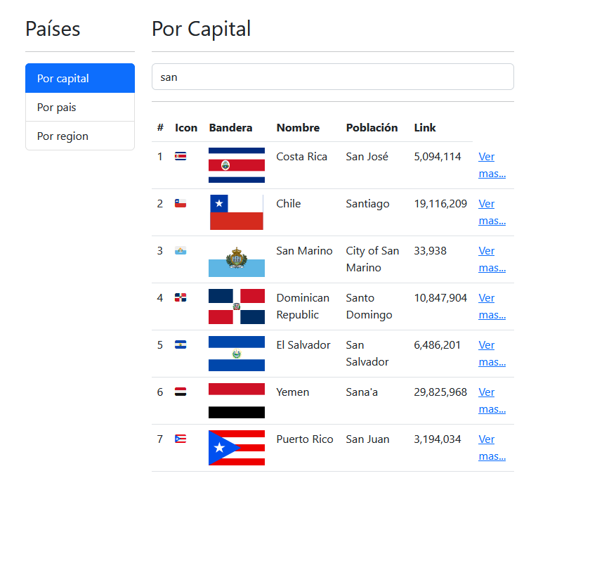

# Países App

Aplicación para buscar países
La usada API solo acepta busqueda de paises con el nombre completo o parte del nombre en ingles

## Vista Online

<!-- REVIEW - PENDIENTE -->

## Vista previa

## Temas de ese proyecto

- Rutas

- RouterLink y RouterLinkActive

- Componentes especializados

- DebounceTime

- Inputs

- SwitchMaps

- Consumo de APIs

- Tipado de datos

- Menú de aplicación

- Persistencia de Datos el localstorage

- Persistencia de data en peticioens

## Levantar proyecto

Levanta la app en local con
    npm run start

Se utilizo los conceptos básicos de angular:
    `Módulos`, `Servicios`, `Interfaces`

Directivas como:
    `ngFor`, `ngIf`, `ngIf else`,

Concepto de flujo de datos
    `two data binding`

Decoradores como:
    `@Input`, `@Output`, `@viewChild`

Eventos con:
    `(onclick)`, `(ngSubmit)`, `(input)`...

## Enlaces

- [Api Country](https://restcountries.com/)
- [Animate css](https://animate.style/)

## Notas

- **@input** recibe datos del padre, lo envia con corchetes `[nameProp]`

      @Input() placeholder: string = "";

- **@output** envia datos al padre

      @Output() onValue: EventEmitter<string> = new EventEmitter();
      (onValue)="nameEventFatherReceptor($event)"

- **Propiedades dinamicas** Una propiedad con `corchetes` permite que las comillas reciban variables o funciones del **.ts**
